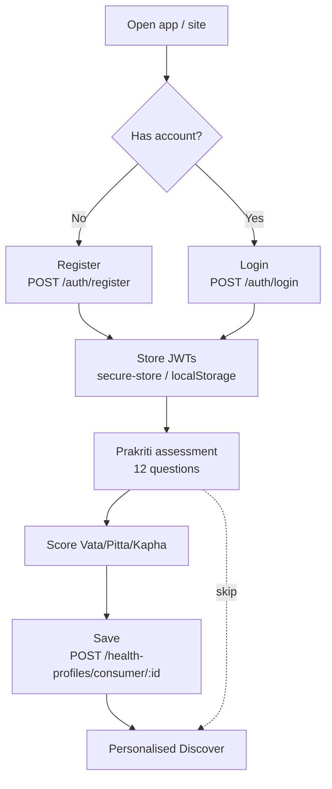
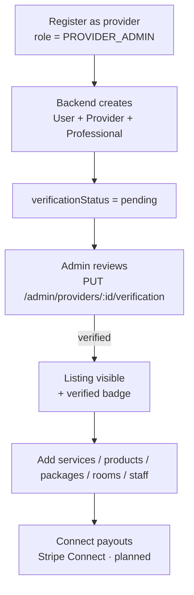
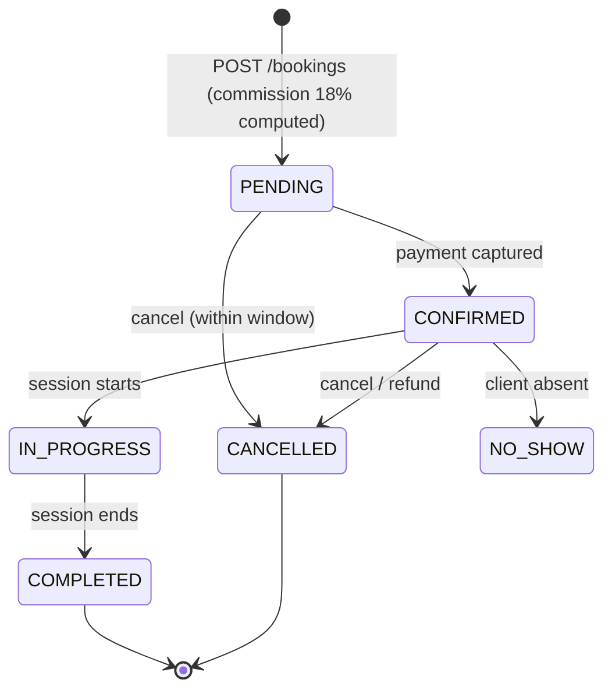
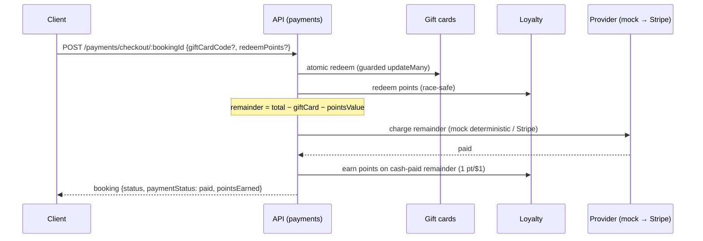
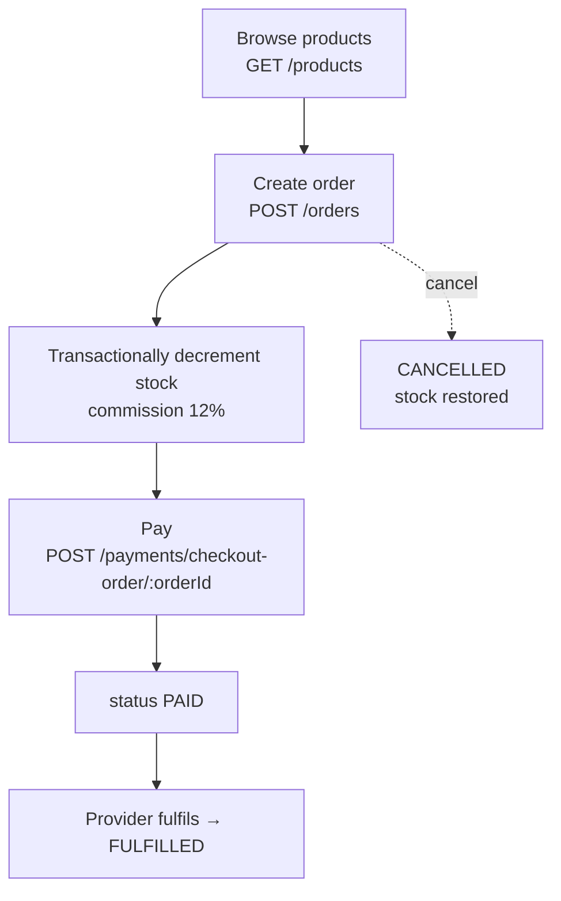
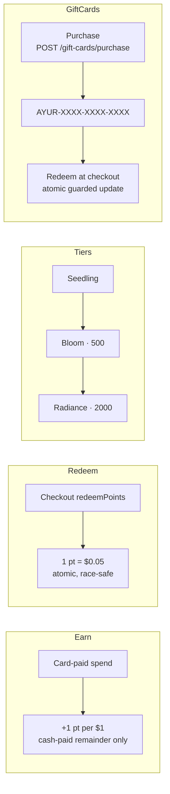
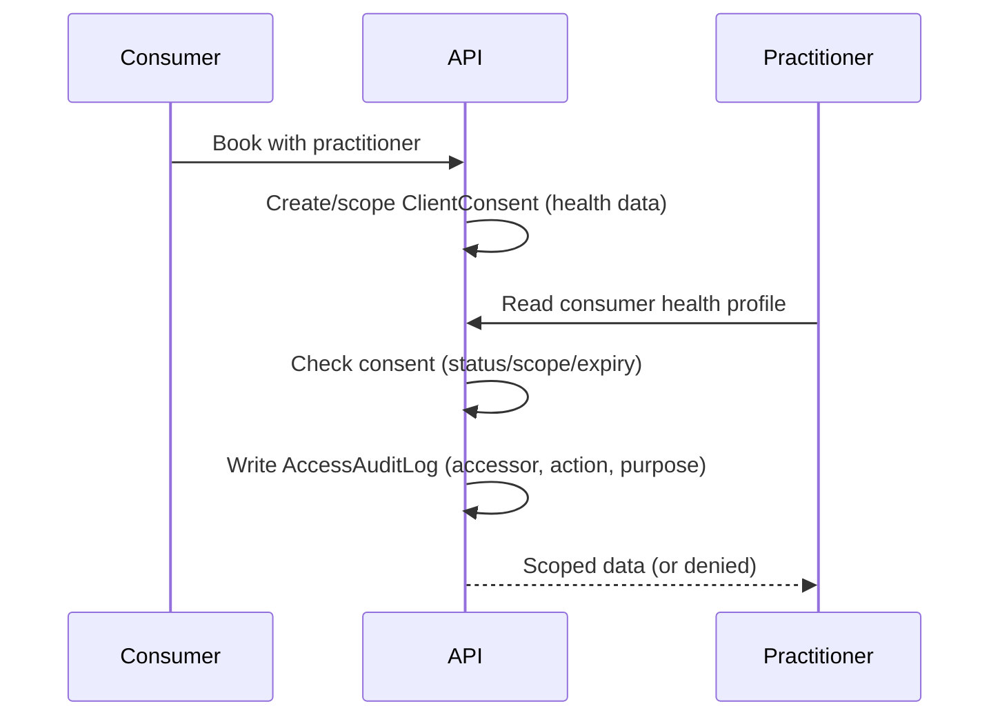
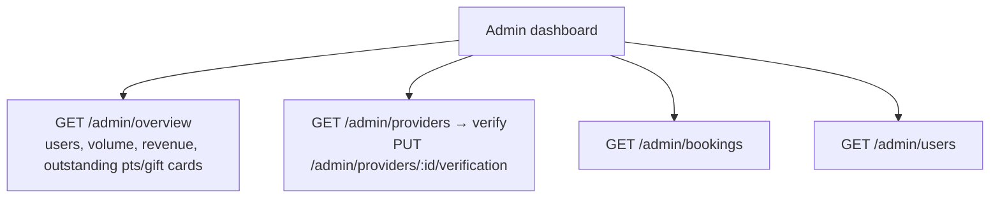
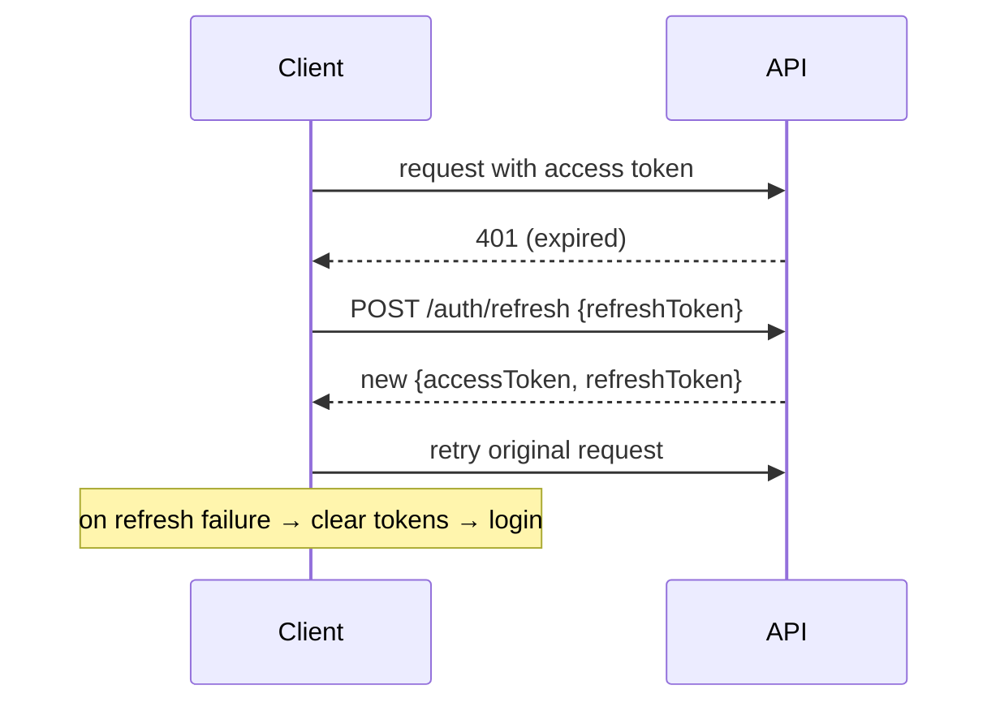

# AyurPass — Application Flows

**Status:** Living document · **Last updated:** 2026-07-15
**Related:** [PRD](./PRD.md) · [UI/UX](./UI_UX_DESIGN.md) · [Backend Schema](./BACKEND_SCHEMA.md)

Diagrams use Mermaid (renders on GitHub and most viewers). Endpoints referenced here are defined in [BACKEND_SCHEMA.md](./BACKEND_SCHEMA.md#rest-api-reference).

---

## 1. Consumer onboarding

The assessment can be retaken anytime from Profile; results persist to the Health Profile.

---

## 2. Provider onboarding

---

## 3. Booking lifecycle

Booking creation computes `platformCommission` and `providerPayout` server-side; `startTime`/`endTime` derive from the service duration.

---

## 4. Checkout & payment (with redemption)

Refunds: `POST /payments/refund/:bookingId` (and `.../refund-order/:orderId`).

---

## 5. Commerce (product order)

---

## 6. Loyalty & gift cards

---

## 7. Privacy, consent & audit

Health data is shared only to deliver a booked service; every sensitive read is auditable. Consent can be revoked (`DELETE /consents/:id`).

---

## 8. Admin operations

All `admin/*` routes are protected by `AdminGuard` (JWT role check).

---

## 9. Session & token refresh

Web stores tokens in `localStorage`; mobile in `expo-secure-store`. Both auto-refresh once, then fall back to login.
