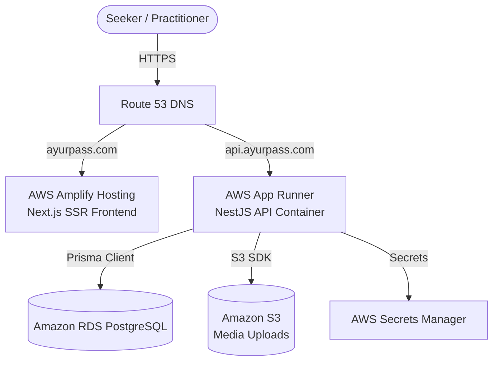

# AyurPass — AWS Amplify & Backend Hosting Playbook

This document outlines the step-by-step playbook to deploy the **AyurPass** monorepo to production on AWS.



---

## 1. Next.js Frontend Deployment on AWS Amplify

AWS Amplify Hosting is used to build, deploy, and host the Next.js SSR application.

### Step 1: Connect GitHub Repository
1. Navigate to the **AWS Amplify Console**.
2. Click **Create New App** and select **GitHub** (or your Git provider).
3. Authorize AWS Amplify and select the `AyurPass` repository and target branch (e.g., `main`).

### Step 2: Configure Monorepo Settings
1. Check the box **"My app is a monorepo"**.
2. Set the **Mono-repo root directory** to: `frontend`
3. Amplify will automatically read the `amplify.yml` configuration from the root of the repository, which specifies:
   - Installing all dependencies from the root (`npm ci`).
   - Running the Next.js production build (`next build`) in `standalone` output mode.
   - Targeting the `.next` artifacts directory.

> [!IMPORTANT]
> **Monorepo Build Error (Cannot read 'next' version in package.json)**:
> If the build fails with this error, go to **App Settings > Environment Variables** in the Amplify Console and manually add:
> *   **Key**: `AMPLIFY_MONOREPO_APP_ROOT`
> *   **Value**: `frontend`
>
> Re-run the build after saving the environment variable.

### Step 3: Configure Environment Variables
In the Amplify Console under **App Settings > Environment Variables**, add the following:

| Environment Variable | Production Value | Description |
|---|---|---|
| `NEXT_PUBLIC_API_URL` | `https://api.ayurpass.com` | Base URL of your NestJS backend |
| `NEXT_PUBLIC_SITE_URL` | `https://www.ayurpass.com` | Base URL of your frontend |
| `NEXT_PUBLIC_STRIPE_PUBLISHABLE_KEY` | `pk_live_...` | Stripe publishable key |

> [!IMPORTANT]
> Since Next.js bakes `NEXT_PUBLIC_` prefixed variables into the client bundle at **build time**, these variables must be defined in the Amplify console **before** starting the deployment build.

---

## 2. NestJS Backend Deployment on AWS App Runner

AWS App Runner provides a fully-managed container runtime, ideal for NestJS servers.

### Step 1: Build & Push Docker Image to ECR
Create a Private Amazon Elastic Container Registry (ECR) repository named `ayurpass-backend`.

Run the following commands from your local machine to build and push the backend container:

```bash
# 1. Login to Amazon ECR
aws ecr get-login-password --region <aws-region> | docker login --username AWS --password-stdin <aws-account-id>.dkr.ecr.<aws-region>.amazonaws.com

# 2. Build the NestJS Docker image (from the backend/ directory context)
cd backend
docker build -t ayurpass-backend .

# 3. Tag and push to ECR
docker tag ayurpass-backend:latest <aws-account-id>.dkr.ecr.<aws-region>.amazonaws.com/ayurpass-backend:latest
docker push <aws-account-id>.dkr.ecr.<aws-region>.amazonaws.com/ayurpass-backend:latest
```

### Step 2: Provision Amazon RDS (PostgreSQL)
1. Create a serverless or provisioned **Amazon RDS PostgreSQL** instance.
2. Configure the security group to allow incoming traffic on port `5432` from the App Runner VPC connector.
3. Obtain the connection string in the format:
   `postgresql://<username>:<password>@<host>:5432/<database_name>?schema=public`

### Step 3: Configure AWS App Runner Service
1. Create a new App Runner service and point it to the ECR image `ayurpass-backend:latest`.
2. Choose **Automatic deployments** if you want App Runner to redeploy on ECR pushes.
3. Under **Configuration**, define the following environment variables (preferably fetched via AWS Secrets Manager Integration):

| Environment Variable | Production Value | Description |
|---|---|---|
| `NODE_ENV` | `production` | Enables production safeguards |
| `PORT` | `4000` | Port the container listens on |
| `DATABASE_URL` | `postgresql://...` | Connection URL to Amazon RDS |
| `JWT_ACCESS_SECRET` | *(Secure Random String)* | Key to sign JWT access tokens |
| `JWT_REFRESH_SECRET` | *(Secure Random String)* | Key to sign JWT refresh tokens |
| `CORS_ORIGIN` | `https://www.ayurpass.com` | Restricts CORS requests to your frontend |
| `STRIPE_SECRET_KEY` | `sk_live_...` | Secret API key for Stripe |

> [!TIP]
> The backend container's entrypoint script ([entrypoint.sh](file:///Users/cultureos/Codebase/Projects/AyurPass/backend/scripts/entrypoint.sh)) automatically runs `npx prisma migrate deploy` prior to launching the NestJS server. This ensures RDS database schemas are updated incrementally on every container start.

---

## 3. Media Uploads Setup (Amazon S3)

To prevent uploads from being lost when the App Runner containers restart or scale, configure object storage.

1. Create a private **Amazon S3** bucket named `ayurpass-media-production`.
2. Configure a Bucket Policy or CloudFront OAI to allow public read access only for files in `/uploads/*`.
3. Create an IAM Role for App Runner and attach a policy allowing `s3:PutObject`, `s3:DeleteObject`, and `s3:GetObject` access.
4. Pass these variables to the backend environment:
   - `AWS_S3_BUCKET=ayurpass-media-production`
   - `AWS_REGION=<aws-region>`

---

## 4. Custom Domain Setup (Route 53)

1. Register your domain (e.g., `ayurpass.com`) in **Route 53**.
2. **Frontend**: Under Amplify Console, go to **Domain management** and add your custom domain. Amplify will provision SSL/TLS certificates and create the Route 53 records automatically.
3. **Backend API**: Under App Runner Service details, go to **Custom domains** and add `api.ayurpass.com`. App Runner will provide CNAME and TXT validation records to create in Route 53 to map the domain securely with HTTPS.
