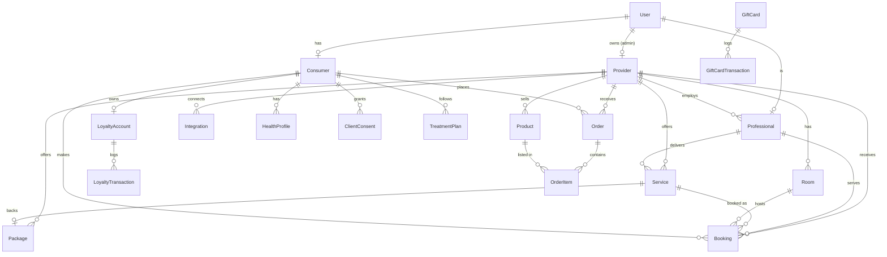

# AyurPass — Backend Schema & API Reference

**Status:** Living document · **Last updated:** 2026-07-15
**Source of truth:** `backend/prisma/schema.prisma` + `backend/src/modules/**`
**Related:** [TRD](./TRD.md) · [App Flows](./APP_FLOW.md)

20 models · 6 enums · PostgreSQL 15 + PostGIS 3.4.

---

## 1. Entity-relationship diagram

---

## 2. Enums

| Enum | Values |
|---|---|
| `Role` | CONSUMER, PROFESSIONAL, PROVIDER_ADMIN, PLATFORM_ADMIN |
| `ProviderType` | AYURVEDA_CLINIC, AYURVEDA_RESORT, PANCHAKARMA_CENTER, WELLNESS_RETREAT, YOGA_STUDIO, LUXURY_SPA, MEDITATION_CENTER, HEALTH_CLUB, COACHING, HYBRID |
| `ServiceCategory` | AYURVEDA, YOGA, SPA, MEDITATION, FITNESS, COACHING, CONSULTATION, PACKAGE |
| `BookingStatus` | PENDING, CONFIRMED, IN_PROGRESS, COMPLETED, CANCELLED, NO_SHOW |
| `OrderStatus` | PENDING, PAID, FULFILLED, CANCELLED, REFUNDED |

---

## 3. Models

### Identity

**User** — root identity. `id`, `email` (unique), `phone?`, `passwordHash?`, `role`, `fullName?`, `avatarUrl?`, timestamps. One-to-one to `Consumer` / `Professional` / `Provider` by role.

**Consumer** (`userId` PK) — `code` (unique, generated), `prakritiPrimary?`, `prakritiScores?` (JSON), `preferences?` (JSON), **`location`** (PostGIS `geography`). Relations: healthProfiles, bookings, consents, treatmentPlans, orders, loyaltyAccount. `onDelete: Cascade` from User.

**Provider** — business. `code`, `userId?` (unique), `businessName`, `type` (ProviderType), `brandProfile?`/`address?` (JSON), `timezone?`, `stripeAccountId?`, `subscriptionTier?`, `verificationStatus` (default `pending`). Relations: professionals, services, products, packages, bookings, treatmentPlans, rooms, orders, integrations.

**Professional** — practitioner. `code`, `userId` (unique), `providerId`, `title?`, `specializations[]`, `doshaExpertise?`, `bio?`, `certifications?`, `yearsExperience?`, `hourlyRate?` Decimal, `availabilityPreferences?`, `verificationDocuments?`, `rating` Decimal, `reviewCount`. Relations: services, bookings, treatmentPlans.

### Catalog

**Service** — bookable unit. `code`, `providerId`, `professionalId?`, `category`, `name`, `description?`, `durationMinutes`, `price` Decimal, `currency` (default USD), `imageUrl?`, `doshaCompatibility?`, `isVirtual`, `maxParticipants`. Relations: bookings, package (optional 1:1).

**Package** — multi-day program. `providerId`, `name`, `description?`, `totalPrice`, `durationDays?`, `includedServices?`/`includedProducts?`/`doshaFocus?` (JSON), `isRecurring`, **`serviceId?`** (unique — the auto-managed bookable Service, category PACKAGE).

**Product** — retail item. `code`, `providerId`, `name`, `category?`, `description?`, `price?` Decimal, `inventoryQuantity?`, `doshaRecommendations?`, `images?` (JSON). Relations: orderItems.

**Room** — physical resource. `providerId`, `name`, `description?`, `capacity`, `hourlyCost?`. Relations: bookings.

### Transactions

**Booking** — `consumerId`, `serviceId`, `professionalId?`, `providerId`, `roomId?`, `startTime`, `endTime`, `timezone?`, `status` (default PENDING), `totalAmount?`, `platformCommission?`, `providerPayout?`, `paymentIntentId?`, `paymentStatus` (default `unpaid`), `giftCardRedeemed`, `pointsRedeemed`, `pointsEarned`, `notes?`.

**Order** — `consumerId`, `providerId`, `status` (default PENDING), `subtotal`, `platformCommission?`, `providerPayout?`, `paymentStatus`, `paymentIntentId?`, `giftCardRedeemed`, `pointsRedeemed`, `pointsEarned`, `shippingAddress?`, `notes?`. Relations: items.

**OrderItem** — `orderId`, `productId`, `quantity`, `unitPrice`. Cascade-deletes with Order.

### Health & personalisation

**HealthProfile** — `consumerId`, `vataScore?`/`pittaScore?`/`kaphaScore?` Decimal(5,2), `questionnaireResponses?`, `currentImbalances?`, `lastAssessment?`.

**TreatmentPlan** — `consumerId`, `professionalId?`, `providerId`, `name?`, `description?`, `startDate?`/`endDate?`, `phases?` (JSON), `status` (default `active`), `aiGenerated` (default false).

**ClientConsent** — `consumerId`, `granteeId?`, `permissionType`, `scope?` (JSON), `expiresAt?`, `status` (default `active`).

**AccessAuditLog** — `id` BigInt autoincrement, `consumerId?`, `accessorId?`, `action`, `resourceType`, `resourceId?`, `purpose?`, `timestamp`, `ipAddress?`.

### Loyalty & gift cards

**LoyaltyAccount** — `consumerId` (unique), `pointsBalance`, `lifetimePoints`. Cascade from Consumer. Relations: transactions.

**LoyaltyTransaction** — `accountId`, `type` (EARN | REDEEM | ADJUST), `points` (signed), `reason`.

**GiftCard** — `code` (unique), `initialBalance`, `balance`, `status` (active | depleted | void), `purchaserId?`, `recipientEmail?`, `message?`. Relations: transactions.

**GiftCardTransaction** — `giftCardId`, `type` (ISSUE | REDEEM | REFUND), `amount`, `reason?`.

### Integrations

**Integration** — `providerId`, `type` (SQUARE_POS | STRIPE_PAYMENTS | GOOGLE_CALENDAR | …), `status` (default `disconnected`), `externalAccountId?`, `config?` (JSON), `connectedAt?`, `lastSyncAt?`. Unique on `(providerId, type)`.

---

## 4. Schema design notes

- **Money:** `Decimal(10,2)`; scores `Decimal(5,2)`. Never floats.
- **Public codes:** `code` on Consumer/Provider/Professional/Service/Product — 7-char, `dbgenerated` (`upper(substr(md5(random()::text),1,7))`), unique. Human-friendly references; **scalar, not a relation** (don't put in Prisma `include`).
- **Geo:** `Consumer.location` is PostGIS `geography` (`Unsupported(...)`) — requires the `postgis/postgis` image and enables radius search.
- **Flexible data:** JSON columns for evolving structures (brandProfile, address, doshaScores, phases, images, config).
- **Cascades:** Consumer→User, Professional→User, LoyaltyAccount→Consumer, OrderItem→Order, LoyaltyTransaction→Account, GiftCardTransaction→GiftCard.
- **Package/Service link:** each Package owns a hidden bookable Service (`category = PACKAGE`) via unique `serviceId`.
- **Money integrity:** commissions/payouts computed server-side; gift-card & points redemption use atomic guarded updates (no double-spend).

---

## 5. REST API reference

Base URL (dev): `http://localhost:4000`. **Auth** = requires `Authorization: Bearer <accessToken>`.

### Auth & users
| Method | Path | Auth | Purpose |
|---|---|---|---|
| POST | `/auth/register` | — | Create account (+ role profile), returns tokens |
| POST | `/auth/login` | — | Login, returns tokens |
| POST | `/auth/refresh` | — | Exchange refresh token |
| GET | `/auth/profile` | ✔ | Current user (+ linked profiles) |
| GET | `/users/:id` · `/users/email/:email` | — | Lookup user |
| POST | `/users` · PUT `/users/:id` | ✔ | Create / update user |

### Discovery & catalog
| Method | Path | Auth | Purpose |
|---|---|---|---|
| GET | `/providers` `?q&type&city&country` | — | Search providers |
| GET | `/providers/:id` · PUT `/providers/:id` | —/✔ | Provider profile / update |
| GET | `/professionals` · `/professionals/provider/:id` · `/professionals/:id` | mixed | Practitioners |
| POST/PUT | `/professionals` · `/professionals/:id` | ✔ | Create / update practitioner |
| GET | `/services` `?category` · `/services/:id` · `/services/provider/:id` | — | Services |
| POST/PUT/DELETE | `/services` · `/services/:id` | ✔ | Manage services |
| GET | `/packages` · `/packages/:id` · `/packages/provider/:id` | — | Packages |
| POST/PUT/DELETE | `/packages` · `/packages/:id` | ✔ | Manage packages |
| GET | `/products` `?category` · `/products/:id` · `/products/provider/:id` | — | Products |
| POST/PUT/DELETE | `/products` · `/products/:id` | ✔ | Manage products |
| GET/POST/PUT/DELETE | `/rooms/provider/:id` · `/rooms` · `/rooms/:id` | ✔ | Manage rooms |

### Bookings & payments
| Method | Path | Auth | Purpose |
|---|---|---|---|
| POST | `/bookings` | ✔ | Create booking (commission computed) |
| GET | `/bookings/consumer/:id` · `/bookings/provider/:id` · `/bookings/:id` | ✔ | List / read |
| PUT | `/bookings/:id` | ✔ | Update status / reschedule |
| GET | `/payments/mode` | — | Payment provider + mock flag |
| POST | `/payments/checkout/:bookingId` | ✔ | Pay booking (`{giftCardCode?, redeemPoints?}`) |
| POST | `/payments/refund/:bookingId` | ✔ | Refund booking |
| POST | `/payments/checkout-order/:orderId` · `/payments/refund-order/:orderId` | ✔ | Pay / refund order |

### Commerce
| Method | Path | Auth | Purpose |
|---|---|---|---|
| POST | `/orders` | ✔ | Create order (stock ↓, 12% commission) |
| GET | `/orders/consumer/:id` · `/orders/provider/:id` · `/orders/:id` | ✔ | List / read |
| PUT | `/orders/:id` | ✔ | Update status |

### Loyalty & gift cards
| Method | Path | Auth | Purpose |
|---|---|---|---|
| GET | `/loyalty/me` | ✔ | Points balance, tier, transactions |
| POST | `/gift-cards/purchase` | ✔ | Buy a gift card |
| GET | `/gift-cards/mine` · `/gift-cards/lookup/:code` | ✔ | Owned / balance lookup |

### Health, plans & consent
| Method | Path | Auth | Purpose |
|---|---|---|---|
| POST/GET/PUT | `/health-profiles/consumer/:id` | ✔ | Save / read dosha profile |
| GET/POST/PATCH/DELETE | `/treatment-plans/*` | ✔ | Treatment plans |
| POST/GET/PUT/DELETE | `/consents/*` | ✔ | Consent records |

### Integrations & admin
| Method | Path | Auth | Purpose |
|---|---|---|---|
| GET | `/integrations/provider/:id` | ✔ | Provider channels |
| POST | `/integrations/connect` · `/integrations/:id/disconnect` · `/integrations/:id/sync` | ✔ | Manage/sync channels (mock) |
| GET | `/admin/overview` · `/admin/providers` · `/admin/bookings` · `/admin/users` | ✔ admin | Platform admin |
| PUT | `/admin/providers/:id/verification` | ✔ admin | Verify provider |

> **Guard status:** `JwtAuthGuard` is the **global** guard — every `✔` route requires a valid token; only `@Public()` routes (auth + discovery GETs) are open. `/admin/*` additionally enforce `AdminGuard`. Consumer-scoped routes enforce ownership (`assertSelfOrAdmin`). Remaining provider-ownership checks are tracked in the [Implementation Plan](./IMPLEMENTATION_PLAN.md#6-immediate-next-step).
