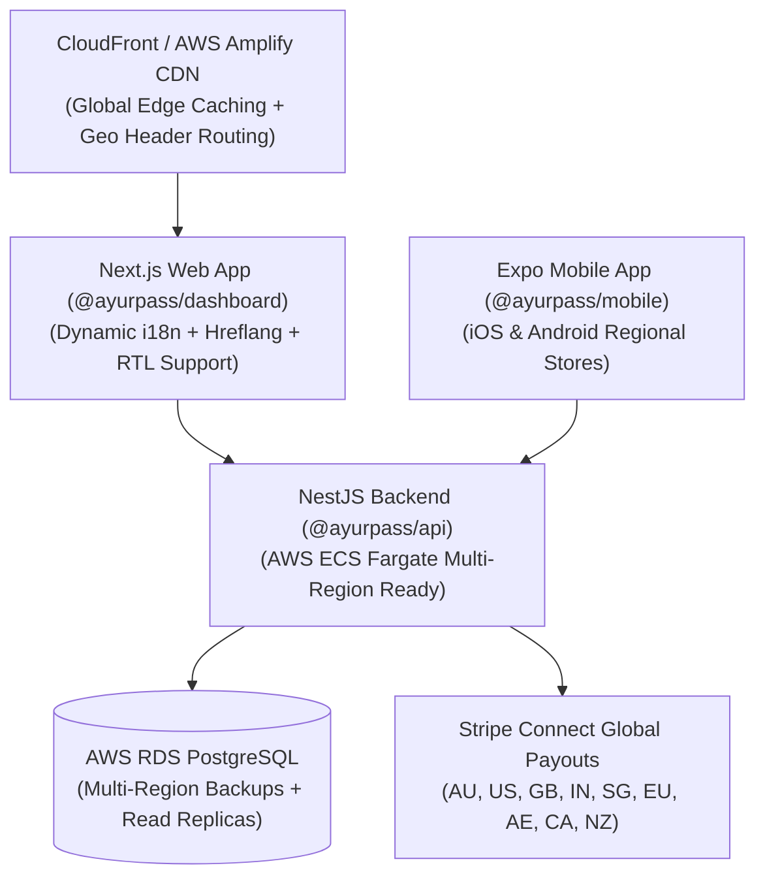

# AyurPass — Global Release & Multi-Region Operations Playbook

**Status:** Live Blueprint · **Version:** 1.0.0 · **Target Launch:** Global (Phase 3/4)  
**Monorepo Coverage:** `@ayurpass/api` (NestJS) · `@ayurpass/dashboard` (Next.js 16) · `@ayurpass/mobile` (Expo SDK 55) · `@ayurpass/shared`

---

## 1. Executive Summary & Global Architecture

AyurPass is engineered as a global wellness marketplace for **Ayurveda, Yoga, Luxury Spa, Meditation, Health Clubs, and Retreats**. The architecture supports cross-border discovery, multi-currency pricing, multi-country Stripe Connect payouts, time-zone-aware scheduling, localized content, and regional legal compliance.



---

## 2. Launch Markets & Region Matrix

AyurPass categorizes global expansion into three launch tiers based on market demand, practitioner density, and payment provider coverage:

| Tier | Countries / Regions | Primary Currency | Tax Model | Key Locales |
|---|---|---|---|---|
| **Tier 1 (Core Launch)** | Australia (AU), India (IN), United States (US), United Kingdom (GB), UAE (AE), Singapore (SG), New Zealand (NZ) | AUD, INR, USD, GBP, AED, SGD, NZD | AU GST (10%), IN GST (18%), UK VAT (20%), SG GST (10%), US Sales Tax (exclusive) | `en`, `hi`, `ar` |
| **Tier 2 (Expansion)** | Canada (CA), Germany (DE), France (FR), Netherlands (NL), Ireland (IE), Sri Lanka (LK), Nepal (NP), Thailand (TH), Indonesia (ID), Malaysia (MY), Japan (JP) | CAD, EUR, LKR, NPR, THB, IDR, MYR, JPY | CA GST (5%), EU VAT (19-23%), Local Tax Rules | `es`, `fr`, `de`, `ja`, `zh-Hans`, `th`, `id` |
| **Tier 3 (Global Reach)** | South Korea (KR), South Africa (ZA), Brazil (BR), Mexico (MX), Philippines (PH), Vietnam (VN) | KRW, ZAR, BRL, MXN, PHP, VND | Standard Tax Engine | `ko`, `pt`, `es` |

---

## 3. Internationalization (i18n) & Localization Architecture

### 3.1 Supported Locales & Direction
AyurPass natively supports **12 global languages** managed via `@ayurpass/shared/locale`:
- **`en`**: English (Default fallback)
- **`hi`**: Hindi (हिन्दी)
- **`es`**: Spanish (Español)
- **`pt`**: Portuguese (Português)
- **`fr`**: French (Français)
- **`de`**: German (Deutsch)
- **`ar`**: Arabic (العربية — **RTL Layout Enabled**)
- **`ja`**: Japanese (日本語)
- **`ko`**: Korean (한국어)
- **`zh-Hans`**: Simplified Chinese (简体中文)
- **`id`**: Indonesian (Bahasa Indonesia)
- **`th`**: Thai (ไทย)

### 3.2 HTML Document Synchronization
When a user selects a preferred language via `LocationModal` or browser auto-detection:
1. `LocationContext` updates state and persists preferences to local storage (`STORAGE_KEY = "ayurpass_location_preferences_v2"`) and cookies (`ayurpass_country`, `ayurpass_currency`, `ayurpass_locale`).
2. Document root attributes automatically synchronize:
   ```javascript
   document.documentElement.lang = selectedLocale;
   document.documentElement.dir = localeDir(selectedLocale); // 'ltr' or 'rtl'
   ```
3. Arabic selection activates right-to-left layout (`dir="rtl"`) across navigation, content drawers, and cards.

---

## 4. Multi-Currency Engine & Price Presentation

### 4.1 AUD Pivot Conversion
All catalog prices are stored in base unit currency with a reference ISO currency code. The front-end currency converter (`apps/dashboard/src/lib/currency.ts` and `packages/shared/src/locale.ts`) calculates localized display amounts using AUD pivot rates:

$$\text{Target Amount} = \left( \frac{\text{Base Amount}}{\text{Rate}_{\text{From}}} \right) \times \text{Rate}_{\text{To}}$$

- Special zero-decimal currencies (JPY, IDR, KRW, VND) automatically round to whole integer values.
- Symbol formatting respects the user's selected locale and currency symbol (e.g. `$`, `₹`, `£`, `€`, `AED`, `¥`).

### 4.2 Checkout Settlement Policy
- **Display Currency**: Converts item prices to the user's localized browsing currency.
- **Settlement Currency**: Processed in the provider's registered native Stripe Connect payout currency to prevent unexpected FX conversion fees for practitioners.

---

## 5. Stripe Connect Multi-Country & Tax Engine

### 5.1 Provider Onboarding Across Global Markets
The NestJS API (`StripeConnectService`) automatically maps provider country names to ISO 3166-1 alpha-2 codes to initialize Connect Custom/Express accounts:
- Custom Capabilities (`card_payments`, `transfers`) are requested based on region capabilities.
- Local currency defaults are derived from ISO country resolution.

### 5.2 Local Tax Calculations (`tax.utility.ts`)
The platform calculates tax based on practice location:
- **Tax-Inclusive Markets (AU, NZ, UK, EU, IN, SG)**: Displayed prices include applicable GST/VAT. Subtotal and tax portion are broken down on customer receipts.
- **Tax-Exclusive Markets (US, CA)**: Applicable Sales Tax or GST is calculated and appended at checkout.

---

## 6. Global Privacy & Cross-Border Legal Compliance

AyurPass operates under strict health and personal data governance:

1. **GDPR & UK GDPR (EU & UK)**:
   - Lawful basis for processing sensitive health data (Prakriti assessment, booking notes) via explicit user consent.
   - User rights to data portability, access requests, and account erasure (`AccessAuditLog`).
2. **CCPA / CPRA (California & United States)**:
   - "Do Not Sell or Share My Personal Information" pledge explicitly documented in Privacy Policy.
   - Sensitive Personal Information (SPI) access controls and audit trails.
3. **India Digital Personal Data Protection (DPDP) Act 2023**:
   - Clear purpose limitation for dosha assessment data and booking information.
4. **Australia Privacy Act 1988 (APP)**:
   - Heightened protections for sensitive health data and cross-border disclosure notifications.
5. **Non-Medical Wellness Disclaimer (HIPAA Scope)**:
   - Prakriti assessments, Ayurvedic educational guides, and dosha recommendations are framed strictly as non-medical wellness lifestyle recommendations. Clinical medical diagnoses remain distinct.

---

## 7. Global SEO, Hreflang & Schema.org Metadata

### 7.1 Hreflang Meta Tags
Every page rendered by Next.js includes canonical links and `alternates.languages` hreflang declarations:
```html
<link rel="canonical" href="https://www.ayurpass.com/" />
<link rel="alternate" hreflang="en" href="https://www.ayurpass.com/" />
<link rel="alternate" hreflang="hi" href="https://www.ayurpass.com/?lang=hi" />
<link rel="alternate" hreflang="es" href="https://www.ayurpass.com/?lang=es" />
<link rel="alternate" hreflang="fr" href="https://www.ayurpass.com/?lang=fr" />
<link rel="alternate" hreflang="de" href="https://www.ayurpass.com/?lang=de" />
<link rel="alternate" hreflang="ar" href="https://www.ayurpass.com/?lang=ar" />
<link rel="alternate" hreflang="ja" href="https://www.ayurpass.com/?lang=ja" />
<link rel="alternate" hreflang="zh-Hans" href="https://www.ayurpass.com/?lang=zh-Hans" />
<link rel="alternate" hreflang="x-default" href="https://www.ayurpass.com/" />
```

### 7.2 Structured Data (Schema.org)
JSON-LD objects embedded across pages:
- **`Organization`**: Brand logo, global description, health & wellness knowledge domains.
- **`WebSite`**: SearchAction for global retreat and practice query resolution.
- **`HealthAndBeautyBusiness`**: Practice local business listings with structured address, geo-coordinates, and price ranges.
- **`Event`**: Dated retreats and workshops with multi-currency offer definitions.

---

## 8. Mobile App (Expo) Global Release Playbook

### 8.1 iOS App Store Regional Availability
- **App Store Connect**: Enable distribution in all 175+ App Store territories.
- **Store Screenshots**: Upload 6.7" and 5.5" localized screenshots highlighting global discovery, booking, and dosha assessment.
- **Privacy Labels**: Declare account data, financial data, and user-provided health info as non-advertising functional data.

### 8.2 Google Play Store Multi-Country Configuration
- **Countries / Regions**: Target Tier 1 & Tier 2 countries with localized store listings.
- **Content Rating**: Complete IARC rating questionnaire for wellness directory and scheduling.

---

## 9. Global Release Readiness Checklist

- [x] **Monorepo Shared Locale**: `packages/shared/src/locale.ts` configured with 12 locales, RTL helper, and translation map `t()`.
- [x] **Web Location & Language Modal**: `LocationModal` and `LocationContext` support Country, Currency, Timezone, and Interface Language switching.
- [x] **HTML Document Sync**: `lang` and `dir` attributes update dynamically on client selection.
- [x] **Multi-Currency Formatting**: Display prices formatted using Intl.NumberFormat with location-aware symbol and fraction digit handling.
- [x] **Stripe Connect Multi-Country**: Multi-country ISO tax and payout resolution operational in NestJS API.
- [x] **Global SEO Metadata**: Canonical and hreflang tags configured in Next.js RootLayout.
- [x] **Mobile App Alignment**: Expo mobile app delegates price formatting to shared `formatMoneyGlobal`.
