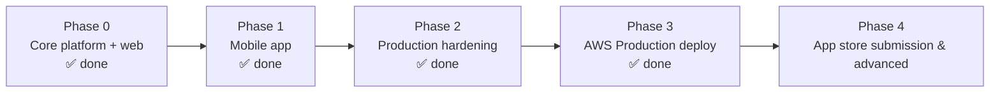

# AyurPass — Implementation Plan

**Status:** Living document · **Last updated:** 2026-07-22
**Related:** [PRD](./PRD.md) · [TRD](./TRD.md) · [Backend Schema](./BACKEND_SCHEMA.md) · [BUILD-LOG](./BUILD-LOG.md)

**Guiding decision:** *enhance and complete the existing foundation — do not rewrite from scratch.* The backend (27 modules), web app, and mobile app are fully built and **live in production on AWS (RDS + ECS Fargate + Amplify Hosting)**.

---

## 1. Current status

### Built & Deployed ✅
- **Backend (NestJS 11 + Prisma 6 + PostgreSQL):** 27 modules live on **AWS ECS Fargate** (`https://api.ayurpass.com`). Auth (JWT access/refresh + throttling), users, providers, professionals, services, packages, rooms, bookings (18% commission), payments (Stripe Connect + mock gated out of production), products & orders, loyalty, gift cards, health profiles, treatment plans, consents (enriched + audit), enquiries, retreats, offers, integrations, admin, quality (reviews/reactions/reports), free listings, vanity handles.
- **Database (AWS RDS PostgreSQL):** Provisioned in `ap-southeast-2` private VPC subnets with 22 Prisma schema migrations applied.
- **Web (Next.js 16 / React 19 / Tailwind v4):** Live on **AWS Amplify Hosting + CloudFront CDN** (`https://ayurpass.com`). Enforces 7 production security headers (CSP, HSTS, X-Frame-Options, etc.), custom branded 404 page, and client error boundary with recovery.
- **Mobile (Expo 55 / React Native 0.83):** Consumer app built with Expo Router SDK 55; typechecks 100% clean in CI.
- **CI/CD Pipeline (GitHub Actions):** `ci.yml` (multi-workspace build + lint + typecheck) and `deploy-backend.yml` (ECR push, Prisma migrate, ECS rolling update) automated on push to `main`.

---

## 2. Roadmap

### Phase 0 — Core platform ✅ (done)
Backend, data model, web app, commerce, loyalty, gift cards.

### Phase 1 — Mobile app ✅ (done)
Expo/React Native consumer app against the live API; standalone install; EAS-ready.

### Phase 2 — Production hardening ✅ (done)
- ✅ Global `JwtAuthGuard` + ownership checks
- ✅ Payment IDOR + auth throttle + prod secrets/CORS + mock-pay guard
- ✅ Consent UI + enriched consents API
- ✅ 7 Production Security Headers (CSP, HSTS, Referrer-Policy, Permissions-Policy, X-Frame-Options, X-Content-Type-Options, X-DNS-Prefetch-Control)
- ✅ Branded 404 & error boundary pages
- ✅ Dockerfile production optimization + healthcheck

### Phase 3 — AWS Production Deployment ✅ (done)
- ✅ **AWS RDS PostgreSQL** (`ayurpass-db`) provisioned with 22 Prisma migrations applied
- ✅ **AWS ECR Repository** (`ayurpass-backend`) created and integrated with GitHub Actions
- ✅ **AWS ECS Fargate** (`ayurpass-api`) running production container behind ALB with ACM SSL certificate (`https://api.ayurpass.com`)
- ✅ **AWS Amplify Hosting** (`https://ayurpass.com`) connected with `NEXT_PUBLIC_API_URL`
- ✅ **GitHub Actions CI/CD** secrets and automated workflow operational

**Exit criteria:** live payments in a test account; all protected routes guarded; errors reported to Sentry; media served from storage/CDN; e2e green in CI.

### Phase 3 — AWS deploy + mobile store (primary path)
**Goal:** reproducible AWS staging, then soft launch; iOS/Android via EAS (Expo 55).  
**Guide:** [AWS-AND-MOBILE-LAUNCH.md](./AWS-AND-MOBILE-LAUNCH.md)

| # | Task |
|---|---|
| 3.1 | ✅ **Dockerize** Nest API (Docker image config ready) |
| 3.2 | **AWS**: VPC, **ECS Fargate** or **App Runner** (API), **RDS Postgres**, **S3**+CloudFront (media), ALB+ACM, **Secrets Manager** |
| 3.3 | ✅ **Web**: Amplify config, standalone build setup, `NEXT_PUBLIC_API_URL` ready |
| 3.4 | **CI/CD** (GitHub Actions): typecheck → build → migrate → deploy staging/prod |
| 3.5 | **Mobile (Expo 55)**: `eas.json` profiles; `EXPO_PUBLIC_API_URL`; EAS Build + Submit iOS/Android |
| 3.6 | **HIPAA** (only if required later): BAA, KMS, audit — optional for directory+enquiry soft launch |
| 3.7 | **Runbooks**: on-call, restore drills |

**Exit criteria:** staging API+web on AWS; TestFlight/Play internal build against staging; then prod DNS + store.

### Phase 4 — Advanced features (future)
- **Telehealth** — Twilio Programmable Video for virtual sessions.
- **AI treatment-plan engine** — populate `TreatmentPlan.phases` from dosha profile + goals (see `docs/09-AI-TREATMENT-PLAN-ENGINE.md`).
- **Analytics suite** for providers; premium listings; white-label (Enterprise).
- **Geo discovery** using `Consumer.location` (PostGIS radius search).

---

## 3. Workstreams & ownership (suggested)

| Workstream | Scope |
|---|---|
| Platform/API | Guards, payments, Redis, consent, tests |
| Web | Dashboard polish, media uploads, provider onboarding |
| Mobile | Payments UX, push notifications, provider app (later) |
| Infra/DevOps | IaC, CI/CD, monitoring, HIPAA |
| Data | Migrations, seed/fixtures, analytics |

---

## 4. Risks & mitigations

| Risk | Impact | Mitigation |
|---|---|---|
| PHI handling before compliance | High | No real PHI until HIPAA infra + BAA; consent + audit enforced first |
| Mock → live payments regressions | High | Keep mock provider for tests; Stripe test mode; webhook idempotency |
| RN/monorepo tooling friction | Med | Mobile installed standalone (not hoisted); pinned Expo SDK; `expo install --fix` |
| Type drift web ↔ mobile | Med | Extract `shared/` package (Phase 2.5) |
| Backend won't boot on TS error | Med | CI typecheck gate; `nest build` in pipeline |
| Cost of AWS/HIPAA at low scale | Med | Start staging small; right-size; managed alternative for non-PHI marketing |

---

## 5. Definition of done (per feature)
1. Typechecks + lints clean (web, mobile, backend).
2. Server-side validation + authorization (guard + ownership).
3. Unit/e2e tests for money/consent-critical paths.
4. No PHI in logs; audit written where applicable.
5. Docs updated (this folder) and migrations committed.

---

## 6. Immediate next step
**Phase 2.1 is done** (global `JwtAuthGuard` + `@Public()` + consumer ownership checks, verified). Next up is **Phase 2.2 — real Stripe Connect** (provider onboarding, destination charges, payouts, webhooks), keeping the mock provider for local/dev, followed by Redis and media storage. See the TRD for the payments abstraction and hosting target.

### Follow-ups within 2.1 (remaining ownership surface)
- Provider-scoped routes (`/bookings/provider/:id`, `/orders/provider/:id`, provider dashboard mutations) should verify the caller owns/administers that provider (needs a provider→user ownership lookup).
- Single-resource reads (`GET /bookings/:id`, `/orders/:id`) should verify the caller is a party to the resource.
- Catalog mutations (`POST/PUT/DELETE` on services/products/packages/rooms) should verify provider ownership.
