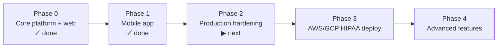

# AyurPass — Implementation Plan

**Status:** Living document · **Last updated:** 2026-07-20
**Related:** [PRD](./PRD.md) · [TRD](./TRD.md) · [Backend Schema](./BACKEND_SCHEMA.md) · [BUILD-LOG](./BUILD-LOG.md)

**Guiding decision:** *enhance and complete the existing foundation — do not rewrite from scratch.* The backend (20+ modules) and web app are built and hardening. Work focuses on: live payments, tests, deploy, and mobile polish. **Hosting target: AWS/GCP, HIPAA-ready.**

---

## 1. Current status

### Built ✅
- **Backend (NestJS + Prisma + PostgreSQL):** auth (JWT access/refresh + throttling), users, providers, professionals, services, packages, rooms, bookings (18% commission), payments (Stripe Connect + mock gated out of production), products & orders, loyalty, gift cards, health profiles, treatment plans, consents (enriched + audit), enquiries, retreats, offers, integrations, admin, quality (reviews/reactions/reports), free listings, vanity handles.
- **Security (2026-07-17):** payment payer ownership, production secret/CORS hard-fail, password min length, auth rate limits, mock pay blocked in production/strict mode; professionals public list strips password hashes.
- **Web (Next.js 16 / React 19 / Tailwind v4):** marketing site, discover/explore/shop/packages/retreats/offers, book + pay, provider/admin dashboard, privacy & permissions, legal pages. Profiles (practice + practitioner) high-end layout; Discover cards with **tags + AAA AU** on one row; link-in-bio share pages; vanity request + admin approval.
- **Mobile (Expo / React Native):** consumer app — auth → dosha → discover → book → pay → profile. Typechecks clean.

### Known gaps / debt
- Stripe Connect live path still needs provider onboarding + webhook ops in each env.
- **No Redis**, no object storage/CDN for media (uploads still local disk).
- ~~Auth guard not applied uniformly~~ ✅ **Fixed (2.1)**
- ~~Payment money-route IDOR~~ ✅ **Fixed (2026-07-17)**
- ~~Consent UI missing~~ ✅ **Consumer privacy page**
- No Docker/deploy, no Sentry, limited automated tests (CI build + typecheck only).
- `shared/` package has types; full shared API client still incomplete.
- Telehealth + AI treatment engine schema-only.
- Web JWT still in `localStorage` (prefer httpOnly cookies later).
- **Not production-hosting ready** until staging deploy + S3 media + live Stripe + observability (see Phase 2–3).

---

## 2. Roadmap

### Phase 0 — Core platform ✅ (done)
Backend, data model, web app, commerce, loyalty, gift cards.

### Phase 1 — Mobile app ✅ (done)
Expo/React Native consumer app against the live API; standalone install; EAS-ready.

### Phase 2 — Production hardening (next)
**Goal:** make the platform safe, observable, and payment-real before deploying.

| # | Task | Notes |
|---|---|---|
| 2.1 | ✅ **Global `JwtAuthGuard`** + ownership checks | done |
| 2.1b | ✅ **Payment IDOR + auth throttle + prod secrets/CORS + mock-pay guard** | done 2026-07-17 |
| 2.1c | ✅ **Consent UI + enriched consents API** | done |
| 2.2 | **Stripe Connect** (real) — provider onboarding, destination charges, payouts, webhooks | keep mock for local only |
| 2.3 | **Redis** — rate limiting store, caching hot reads, refresh revocation | Upstash/ElastiCache |
| 2.4 | **Object storage** — media uploads to S3/R2 + CDN | provider logos, service images |
| 2.5 | **`shared/` package** — API client + zod for web + mobile | partial types only |
| 2.6 | **Observability** — Sentry (api/web/mobile), structured logging (no PHI) | |
| 2.7 | ✅ **CORS allowlist + HSTS (strict)**; expand CSP on Next | partial — CSP next |
| 2.8 | ✅ **Consent enforcement + audit** on health reads + consumer privacy page | |
| 2.9 | **Automated tests in CI** — unit + API e2e for money/consent/IDOR | next priority |
| 2.10 | **httpOnly session cookies** — retire `localStorage` JWT | |
| 2.11 | **SSR/pagination** for discover/explore (LCP + SEO) | |

**Exit criteria:** live payments in a test account; all protected routes guarded; errors reported to Sentry; media served from storage/CDN; e2e green in CI.

### Phase 3 — AWS deploy + mobile store (primary path)
**Goal:** reproducible AWS staging, then soft launch; iOS/Android via EAS (Expo 55).  
**Guide:** [AWS-AND-MOBILE-LAUNCH.md](./AWS-AND-MOBILE-LAUNCH.md)

| # | Task |
|---|---|
| 3.1 | ✅ **Dockerize** Nest API (Docker image config ready) |
| 3.2 | **AWS**: VPC, **ECS Fargate** or **App Runner** (API), **RDS Postgres**, **S3**+CloudFront (media), ALB+ACM, **Secrets Manager** |
| 3.3 | ✅ **Web**: Amplify config, standalone build setup, `NEXT_PUBLIC_API_URL` ready |
| 3.4 | **CI/CD** (GitHub Actions): typecheck → build → migrate → deploy staging/prod |
| 3.5 | **Mobile (Expo 55)**: `eas.json` profiles; `EXPO_PUBLIC_API_URL`; EAS Build + Submit iOS/Android |
| 3.6 | **HIPAA** (only if required later): BAA, KMS, audit — optional for directory+enquiry soft launch |
| 3.7 | **Runbooks**: on-call, restore drills |

**Exit criteria:** staging API+web on AWS; TestFlight/Play internal build against staging; then prod DNS + store.

### Phase 4 — Advanced features (future)
- **Telehealth** — Twilio Programmable Video for virtual sessions.
- **AI treatment-plan engine** — populate `TreatmentPlan.phases` from dosha profile + goals (see `docs/09-AI-TREATMENT-PLAN-ENGINE.md`).
- **Analytics suite** for providers; premium listings; white-label (Enterprise).
- **Geo discovery** using `Consumer.location` (PostGIS radius search).

---

## 3. Workstreams & ownership (suggested)

| Workstream | Scope |
|---|---|
| Platform/API | Guards, payments, Redis, consent, tests |
| Web | Dashboard polish, media uploads, provider onboarding |
| Mobile | Payments UX, push notifications, provider app (later) |
| Infra/DevOps | IaC, CI/CD, monitoring, HIPAA |
| Data | Migrations, seed/fixtures, analytics |

---

## 4. Risks & mitigations

| Risk | Impact | Mitigation |
|---|---|---|
| PHI handling before compliance | High | No real PHI until HIPAA infra + BAA; consent + audit enforced first |
| Mock → live payments regressions | High | Keep mock provider for tests; Stripe test mode; webhook idempotency |
| RN/monorepo tooling friction | Med | Mobile installed standalone (not hoisted); pinned Expo SDK; `expo install --fix` |
| Type drift web ↔ mobile | Med | Extract `shared/` package (Phase 2.5) |
| Backend won't boot on TS error | Med | CI typecheck gate; `nest build` in pipeline |
| Cost of AWS/HIPAA at low scale | Med | Start staging small; right-size; managed alternative for non-PHI marketing |

---

## 5. Definition of done (per feature)
1. Typechecks + lints clean (web, mobile, backend).
2. Server-side validation + authorization (guard + ownership).
3. Unit/e2e tests for money/consent-critical paths.
4. No PHI in logs; audit written where applicable.
5. Docs updated (this folder) and migrations committed.

---

## 6. Immediate next step
**Phase 2.1 is done** (global `JwtAuthGuard` + `@Public()` + consumer ownership checks, verified). Next up is **Phase 2.2 — real Stripe Connect** (provider onboarding, destination charges, payouts, webhooks), keeping the mock provider for local/dev, followed by Redis and media storage. See the TRD for the payments abstraction and hosting target.

### Follow-ups within 2.1 (remaining ownership surface)
- Provider-scoped routes (`/bookings/provider/:id`, `/orders/provider/:id`, provider dashboard mutations) should verify the caller owns/administers that provider (needs a provider→user ownership lookup).
- Single-resource reads (`GET /bookings/:id`, `/orders/:id`) should verify the caller is a party to the resource.
- Catalog mutations (`POST/PUT/DELETE` on services/products/packages/rooms) should verify provider ownership.
