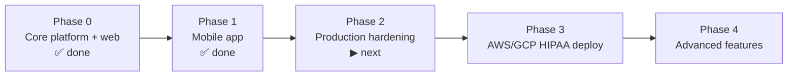

# AyurPass — Implementation Plan

**Status:** Living document · **Last updated:** 2026-07-15
**Related:** [PRD](./PRD.md) · [TRD](./TRD.md) · [Backend Schema](./BACKEND_SCHEMA.md)

**Guiding decision:** *enhance and complete the existing foundation — do not rewrite from scratch.* The backend (18 modules, 20 models) and web app are built, verified, and aligned with the blueprint. Work focuses on filling real gaps: mobile, hardening, and deployment. **Hosting target: AWS/GCP, HIPAA-ready.**

---

## 1. Current status

### Built ✅
- **Backend (NestJS + Prisma + PostgreSQL/PostGIS):** auth (JWT access/refresh), users, providers, professionals, services, packages, rooms, bookings (18% commission), payments (mock + redemption), products & orders (12% commission, transactional stock), loyalty, gift cards (atomic), health profiles, treatment plans, consents, integrations (mock), admin.
- **Web (Next.js 16 / React 19 / Tailwind v4):** marketing site, consumer flows (discover, explore, shop, packages, book), provider/admin dashboard, content & legal pages, wellness guide.
- **Mobile (Expo / React Native):** consumer app — auth → dosha assessment → discover → book → pay → profile. Typechecks clean; iOS bundle exports successfully.

### Known gaps / debt
- Payments are **mock** (no live Stripe Connect).
- **No Redis**, no real object storage for media, no CDN.
- ~~Auth guard not applied uniformly~~ ✅ **Fixed (2.1):** global `JwtAuthGuard` + `@Public()`; consumer-scoped routes enforce ownership (`assertSelfOrAdmin`).
- No infra: no Docker images for services, no CI/CD, no hosting, no monitoring.
- `shared/` package is empty (types duplicated between web and mobile).
- Telehealth video and AI treatment-plan engine are schema-only.

---

## 2. Roadmap

### Phase 0 — Core platform ✅ (done)
Backend, data model, web app, commerce, loyalty, gift cards.

### Phase 1 — Mobile app ✅ (done)
Expo/React Native consumer app against the live API; standalone install; EAS-ready.

### Phase 2 — Production hardening (next)
**Goal:** make the platform safe, observable, and payment-real before deploying.

| # | Task | Notes |
|---|---|---|
| 2.1 | ✅ **Global `JwtAuthGuard`** on all routes (`@Public()` opt-out) + consumer ownership checks (`assertSelfOrAdmin`) | done & verified — closes the no-token gap **and** the consumer IDOR |
| 2.2 | **Stripe Connect** (real) — provider onboarding, destination charges, payouts, webhooks | replace mock; keep mock for dev/test |
| 2.3 | **Redis** — rate limiting, caching hot reads, session/refresh handling | Upstash/ElastiCache |
| 2.4 | **Object storage** — media uploads to S3/R2 + CDN; replace data-URL/arbitrary-host images | provider logos, service images, avatars |
| 2.5 | **`shared/` package** — single source of API types + client for web + mobile | remove duplication |
| 2.6 | **Observability** — Sentry (api/web/mobile), structured logging (no PHI), health/readiness endpoints | |
| 2.7 | **Security headers + CORS** per environment; secrets via env/secret store | |
| 2.8 | **Consent enforcement + audit** wired into every health-data read | `ClientConsent` + `AccessAuditLog` |
| 2.9 | **Automated tests in CI** — unit + API e2e; promote `scratchpad/*-e2e.mjs` into the suite | money/consent paths first |

**Exit criteria:** live payments in a test account; all protected routes guarded; errors reported to Sentry; media served from storage/CDN; e2e green in CI.

### Phase 3 — AWS/GCP HIPAA-ready deployment
**Goal:** compliant, reproducible cloud with CI/CD.

| # | Task |
|---|---|
| 3.1 | **Dockerize** backend (and web); multi-stage builds |
| 3.2 | **Infrastructure as Code** (Terraform/CDK): VPC, ECS Fargate, RDS PostgreSQL+PostGIS, ElastiCache Redis, S3, CloudFront, ALB, Secrets Manager |
| 3.3 | **CI/CD** (GitHub Actions): lint → typecheck → test → build → migrate → deploy; staging + prod |
| 3.4 | **HIPAA**: sign BAA; encryption at rest (KMS) + in transit; audit logging; least-privilege IAM; backup/PITR |
| 3.5 | **Mobile release**: EAS Build + Submit to App Store & Play Store; production `apiUrl`; OTA updates |
| 3.6 | **Runbooks**: on-call, incident response, restore drills |

**Exit criteria:** one-command deploy to staging; blue/green or rolling prod deploy; RDS backups + tested restore; BAA in place.

### Phase 4 — Advanced features (future)
- **Telehealth** — Twilio Programmable Video for virtual sessions.
- **AI treatment-plan engine** — populate `TreatmentPlan.phases` from dosha profile + goals (see `docs/09-AI-TREATMENT-PLAN-ENGINE.md`).
- **Analytics suite** for providers; premium listings; white-label (Enterprise).
- **Geo discovery** using `Consumer.location` (PostGIS radius search).

---

## 3. Workstreams & ownership (suggested)

| Workstream | Scope |
|---|---|
| Platform/API | Guards, payments, Redis, consent, tests |
| Web | Dashboard polish, media uploads, provider onboarding |
| Mobile | Payments UX, push notifications, provider app (later) |
| Infra/DevOps | IaC, CI/CD, monitoring, HIPAA |
| Data | Migrations, seed/fixtures, analytics |

---

## 4. Risks & mitigations

| Risk | Impact | Mitigation |
|---|---|---|
| PHI handling before compliance | High | No real PHI until HIPAA infra + BAA; consent + audit enforced first |
| Mock → live payments regressions | High | Keep mock provider for tests; Stripe test mode; webhook idempotency |
| RN/monorepo tooling friction | Med | Mobile installed standalone (not hoisted); pinned Expo SDK; `expo install --fix` |
| Type drift web ↔ mobile | Med | Extract `shared/` package (Phase 2.5) |
| Backend won't boot on TS error | Med | CI typecheck gate; `nest build` in pipeline |
| Cost of AWS/HIPAA at low scale | Med | Start staging small; right-size; managed alternative for non-PHI marketing |

---

## 5. Definition of done (per feature)
1. Typechecks + lints clean (web, mobile, backend).
2. Server-side validation + authorization (guard + ownership).
3. Unit/e2e tests for money/consent-critical paths.
4. No PHI in logs; audit written where applicable.
5. Docs updated (this folder) and migrations committed.

---

## 6. Immediate next step
**Phase 2.1 is done** (global `JwtAuthGuard` + `@Public()` + consumer ownership checks, verified). Next up is **Phase 2.2 — real Stripe Connect** (provider onboarding, destination charges, payouts, webhooks), keeping the mock provider for local/dev, followed by Redis and media storage. See the TRD for the payments abstraction and hosting target.

### Follow-ups within 2.1 (remaining ownership surface)
- Provider-scoped routes (`/bookings/provider/:id`, `/orders/provider/:id`, provider dashboard mutations) should verify the caller owns/administers that provider (needs a provider→user ownership lookup).
- Single-resource reads (`GET /bookings/:id`, `/orders/:id`) should verify the caller is a party to the resource.
- Catalog mutations (`POST/PUT/DELETE` on services/products/packages/rooms) should verify provider ownership.
