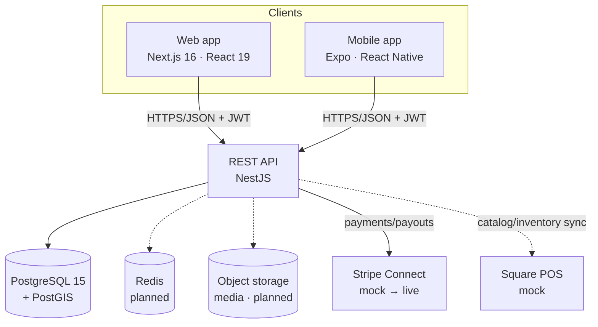
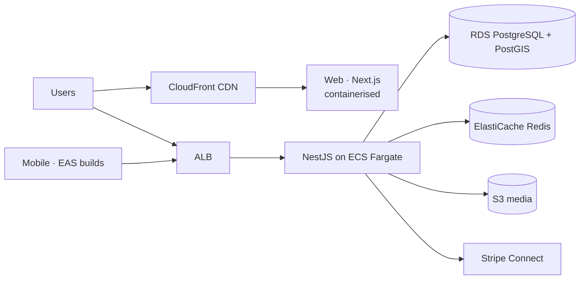

# AyurPass — Technical Requirements Document (TRD)

**Status:** Living document · **Last updated:** 2026-07-15
**Related:** [PRD](./PRD.md) · [Backend Schema](./BACKEND_SCHEMA.md) · [App Flows](./APP_FLOW.md) · [Implementation Plan](./IMPLEMENTATION_PLAN.md)

---

## 1. System architecture

AyurPass is a monorepo with three client-facing surfaces over one API and one database.



### Repository layout

```
AyurPass/
  apps/api         NestJS API + Prisma (PostgreSQL/PostGIS)
  apps/dashboard   Next.js web app (marketing + consumer + provider dashboard)
  apps/mobile      Expo/React Native consumer app (iOS + Android)
  packages/shared  Shared types, tokens, and API contracts
  docs/            Product & engineering documentation
```

---

## 2. Technology stack

| Layer | Technology | Version / notes |
|---|---|---|
| **Backend** | NestJS (Node.js, TypeScript) | `@nestjs/*` v11; Express platform |
| **ORM** | Prisma | 6.x; `@prisma/client` hoisted to root `node_modules` (workspace) |
| **Database** | PostgreSQL + PostGIS | PG 15 / PostGIS 3.4; `geography` type for consumer location |
| **Auth** | `@nestjs/jwt` + bcrypt | Access + refresh JWTs, separate secrets |
| **Validation** | class-validator / class-transformer | DTO-level validation |
| **Web** | Next.js + React + Tailwind CSS | Next 16.2, React 19.2, Tailwind v4 (App Router) |
| **Mobile** | Expo + React Native + Expo Router | Expo SDK 52, RN 0.76.9, TypeScript; SecureStore for tokens |
| **Cache/queue** | Redis | Planned (rate-limiting, sessions, queues) |
| **Payments** | Stripe Connect | Mock provider now; live Connect planned |
| **Runtime** | Node 18+ | |

---

## 3. Backend design

### 3.1 Modules (18)
`auth`, `users`, `providers`, `professionals`, `services`, `packages`, `rooms`, `bookings`, `payments`, `products`, `orders`, `loyalty`, `gift-cards`, `health-profiles`, `treatment-plans`, `consents`, `integrations`, `admin`.

Each module is a standard NestJS module (Controller → Service → PrismaService). Full endpoint list is in [BACKEND_SCHEMA.md](./BACKEND_SCHEMA.md#rest-api-reference).

### 3.2 API conventions
- REST/JSON over HTTPS. Base URL `http://localhost:4000` in dev.
- `Authorization: Bearer <accessToken>` for protected routes.
- Errors return `{ message }` (string or string[]); clients surface `message`.
- Money stored as `Decimal(10,2)`; serialised as string/number — clients coerce with `Number()`.
- Short public **`code`** fields (7-char, DB-generated) on Consumer/Provider/Professional/Service/Product for human-friendly references.

### 3.3 Authentication & authorization
- **Registration** hashes password (bcrypt, cost 10), creates User + role profile, returns `{ user, accessToken, refreshToken }`.
- **Access token** ~15 min; **refresh token** ~7 days; signed with distinct secrets (`JWT_ACCESS_SECRET`, `JWT_REFRESH_SECRET`).
- **Guards:** `JwtAuthGuard` is the **global `APP_GUARD`** — every route requires a valid access token unless annotated `@Public()` (auth + public discovery routes). It derives identity from `token.sub` (never client-supplied ids) and attaches `req.user`. `AdminGuard` (JWT role check) additionally protects `admin/*`.
- **Ownership:** consumer-scoped routes (bookings, orders, health profiles, treatment plans, consents) enforce `assertSelfOrAdmin(req.user, consumerId)` — a valid token can only reach its own data (prevents IDOR).
- **`sanitizeUser`** strips `passwordHash` from all auth/user responses.

> **Ownership backlog:** provider-scoped routes and single-resource reads/mutations still need provider-ownership checks — tracked in the Implementation Plan (Phase 2.1 follow-ups).

### 3.4 Business rules (server-enforced)
- **Booking commission:** 18% platform commission; provider payout = total − commission.
- **Order commission:** 12%; stock decremented transactionally on order, restored on cancel.
- **Loyalty:** earn 1 pt / $1 of **card-paid** amount; 1 pt = $0.05 redemption value; tiers Seedling / Bloom (500) / Radiance (2000). Points earned only on the cash-paid remainder.
- **Gift cards:** `AYUR-XXXX-XXXX-XXXX` via `crypto.randomInt` over an unambiguous alphabet; redemption is an atomic guarded `updateMany` (race-safe, no double-spend).
- **Packages:** each Package auto-creates a linked bookable Service (`category = PACKAGE`).

### 3.5 Payments abstraction
- `GET /payments/mode` reports `{ provider, mock }`. Mock mode is active when `STRIPE_SECRET_KEY` is unset or ends in `...`.
- Checkout endpoints accept an optional `RedemptionDto { giftCardCode?, redeemPoints? }`.
- Production path: **Stripe Connect** (provider onboarding, destination charges, payouts). Steps documented in `payments.service.ts`.

### 3.6 Integrations
- `integrations` module models external channels (Square POS, Stripe, calendar). Currently **mock** unless credentials present; real Square Catalog/Inventory/Bookings sync steps documented in `integrations.service.ts`.

---

## 4. Data layer

- **PostgreSQL 15 + PostGIS 3.4.** The `postgis/postgis` image is required (not plain `postgres`) because `Consumer.location` uses the PostGIS `geography` type (`Unsupported("geography")` in Prisma).
- **20 models / 6 enums.** Full definitions and ERD in [BACKEND_SCHEMA.md](./BACKEND_SCHEMA.md).
- **Migrations:** Prisma Migrate (`prisma migrate dev` / `deploy`). `code` columns use a `dbgenerated` default; adding them is an additive migration.
- **JSON columns** for flexible/evolving data (brandProfile, address, doshaScores, phases, images, config).

---

## 5. Client applications

### 5.1 Web (Next.js)
- App Router; marketing site + consumer flows + provider/admin dashboard under `/dashboard/*`.
- Design tokens in `globals.css` (Tailwind v4 `@theme`). API client in `src/lib/api.ts`; auth context stores JWTs in `localStorage`.

### 5.2 Mobile (Expo/React Native)
- Expo Router (file-based). Consumer journey: auth → dosha assessment → discover → book → pay → profile.
- Tokens in **`expo-secure-store`**; API base URL auto-detects the dev host LAN IP (physical-device friendly) or reads `extra.apiUrl` for staging/prod.
- **Installed standalone** (intentionally not a root workspace) to avoid React Native/Metro dependency-hoisting problems. Build/submit via **EAS**.

---

## 6. Security & privacy

- **Transport:** HTTPS everywhere in production; HSTS + security headers (planned via middleware/edge).
- **Secrets:** environment variables; move to a managed secrets store (AWS Secrets Manager / SSM) in the cloud.
- **PHI protection:** consent-gated access to health data; `AccessAuditLog` records sensitive reads; no PHI in application logs.
- **Compliance target:** HIPAA-eligible infrastructure (AWS/GCP with a signed BAA). RBAC, encryption in transit and at rest, audit trails.
- **Rate limiting / abuse:** planned (Redis-backed).

---

## 7. Hosting & infrastructure (target: AWS/GCP, HIPAA-ready)



| Concern | Choice |
|---|---|
| Compute (API) | AWS ECS Fargate (containerised NestJS) |
| Database | RDS PostgreSQL with PostGIS |
| Cache | ElastiCache Redis |
| Object storage | S3 (media) + CloudFront |
| Web hosting | Containerised Next.js behind CloudFront (or Vercel for non-PHI marketing) |
| Mobile builds | Expo EAS Build + Submit |
| Secrets | AWS Secrets Manager / SSM Parameter Store |
| Compliance | Signed BAA; encryption at rest (KMS) + in transit |

> A cheaper managed alternative (Vercel + Railway/Render + Supabase + Cloudflare R2) exists for pre-compliance stages; AWS/GCP is the chosen target for HIPAA.

---

## 8. Observability, CI/CD, environments

- **CI/CD:** GitHub Actions — lint, typecheck, test, build, migrate, deploy (planned).
- **Monitoring:** Sentry (backend/web/mobile), structured logs, uptime + DB metrics (planned).
- **Environments:** `local` → `staging` → `production`, each with isolated DB and secrets.
- **Testing:** unit (services), integration (API e2e), and scripted end-to-end flows (existing `scratchpad/*-e2e.mjs` verified commerce & rewards). Target: CI-run e2e per PR.

---

## 9. Local development

- Postgres via Docker Compose: service `db`, image `postgis/postgis:15-3.3-alpine`, host port **5433**, database `ayurpass`.
- API on **:4000** (`npm run dev:api`), web on **:3000** (`npm run dev:dashboard`); root `npm start` runs both via `concurrently`.
- Mobile: `npm run dev:mobile` from the monorepo root.

---

## 10. Non-functional targets

| Metric | Target |
|---|---|
| API p95 latency | < 300 ms (cached reads < 100 ms) |
| Availability | 99.9% |
| RPO / RTO | ≤ 24h / ≤ 1h (automated RDS backups + PITR) |
| Accessibility | WCAG 2.1 AA |
| Test coverage | Critical money/consent paths covered by e2e |
