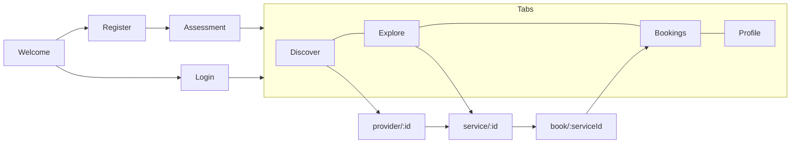

# AyurPass — UI/UX Design

**Status:** Living document · **Last updated:** 2026-07-15
**Related:** [PRD](./PRD.md) · [App Flows](./APP_FLOW.md) · [TRD](./TRD.md)

Design tokens are the single source of truth in code: web in `apps/dashboard/src/app/globals.css` (Tailwind v4 `@theme`), mobile in `apps/mobile/src/theme.ts`. This document describes the system they encode.

---

## 1. Design principles

1. **Calm, warm, premium.** A warm-ivory canvas with deep forest greens and gold accents — restorative, not clinical.
2. **Authenticity first.** Vedic language (Prakriti, dosha, Abhyanga) used correctly; verification signalled clearly.
3. **Personalisation is visible.** The dosha result and its colours recur across the product.
4. **One brand, two surfaces.** Web and mobile share palette, typography, and component language.
5. **Accessible by default.** AA contrast; colour never the only signal; large tap targets on mobile.

---

## 2. Brand identity

### 2.1 Colour palette (committed warm-ivory light theme)

| Token | Hex | Use |
|---|---|---|
| `background` | `#f6f3ec` | App canvas |
| `surface` | `#fffdf9` | Cards, sheets |
| `foreground` | `#211e19` | Primary text |
| `ink-secondary` | `#57534a` | Body / secondary text |
| `ink-muted` | `#8a857a` | Meta, placeholders |
| `hairline` | `#e7e1d4` | Borders, dividers |
| `forest` | `#24382e` | Primary brand / buttons / headings |
| `forest-deep` | `#182720` | Hover / gradients |
| `leaf` | `#3d6650` | Secondary / success accents |
| `gold` | `#b9892f` | Accent, emphasis, CTAs |
| `gold-soft` | `#e9d9b8` | On-dark accents, highlights |
| `clay` | `#f0e9db` | Subtle fills, chips |

**Dosha colours** (CVD-validated against the card surface): `vata #4a3aa7`, `pitta #eb6834`, `kapha #1baf7a`.

### 2.2 Typography
- **Display:** *Fraunces* (serif) — headings, brand voice.
- **Body/UI:** *Inter* (sans) — text, controls.
- Mobile loads these via `@expo-google-fonts/fraunces` + `inter`; web via `next/font`.

### 2.3 Shape & elevation
- Radii: pills for actions/badges (`999`), `16–22px` for cards/sheets.
- Soft shadows only for lifted surfaces; hairline borders elsewhere.
- Signature motif: outlined **leaf** mark (brand + app icon), on a forest gradient.

---

## 3. Core components

| Component | Web (`components/`, `ui.tsx`) | Mobile (`src/components/ui.tsx`) |
|---|---|---|
| Button | primary / ghost / danger, pill | primary / gold / ghost, pill |
| Card | `surface` + hairline, radius-lg | same |
| Field / Input | label + hint + focus ring | label + `TextInput` |
| Badge / Pill | tone leaf / gold / muted | same |
| Dosha meter | `DoshaMeter` bars (Vata/Pitta/Kapha) | `DoshaMeter` bars |
| BrandMark | provider logo or discipline icon fallback | discipline Ionicon fallback |
| Empty / Error / Loading states | `EmptyState`, `ErrorNote` | `EmptyState`, `ErrorNote`, `Loading` |

Iconography: hand-built SVG set on web (`icons.tsx`); **Ionicons** (`@expo/vector-icons`) on mobile, mapped per provider type and service category in `catalog`.

---

## 4. Layout & navigation

### 4.1 Web
- Global `LayoutWrapper` = Navbar + content + Footer.
- Marketing/content pages: `/`, `/wellness`, `/help`, `/faq`, `/contact`, `/partners`, legal (`/privacy`, `/terms`, `/cookies`, `/accessibility`).
- Consumer: `/discover`, `/explore`, `/shop`, `/packages`, `/providers/[id]`, `/book/[serviceId]`, `/login`, `/register`.
- Provider/admin: `/dashboard/*` (services, products, packages, rooms, bookings, orders, team, calendar, business, rewards, gift-cards, admin, …).
- Responsive: mobile-first, `max-w-6xl` content columns, fluid grids.

### 4.2 Mobile (Expo Router)
- **Auth stack:** welcome → register / login.
- **Onboarding:** `assessment` (modal-style) after registration.
- **Tab bar:** Discover · Explore · Bookings · Profile.
- **Detail stack:** `provider/[id]`, `service/[id]`, `book/[serviceId]`.

---

## 5. Key screens & states

| Flow | Web | Mobile |
|---|---|---|
| Dosha assessment | intro → 12 questions (progress bar) → result with meters | same, native |
| Discovery | searchable provider grid/list, verified badge, location | searchable list + pull-to-refresh |
| Service detail | name, provider, duration, price, description, book CTA | same, sticky price bar |
| Booking | day/time selection, notes, confirm | day chips + time chips + notes |
| Bookings list | status badges, pay action | status badges, "Pay now" |
| Profile | dosha meters, rewards, settings | dosha meters, rewards card, sign out |

Every list defines **loading**, **empty**, and **error** states; forms show inline validation and a single error note.

---

## 6. Accessibility
- Target **WCAG 2.1 AA**. Text meets contrast on `surface`/`background`.
- Dosha meter colours validated for common colour-vision deficiencies; labels + percentages accompany the bars (colour is never the sole signal).
- Semantic structure and labelled fields on web; screen-reader labels and ≥44px targets on mobile.
- Decorative illustrations marked `aria-hidden`; meaningful images carry alt text.
- Accessibility statement published at `/accessibility`.

---

## 7. Theming notes
- Current committed theme is the **warm-ivory light** theme (`color-scheme: light`).
- Tokens are centralised, so a future dark theme is a token-set addition, not a rewrite.
- Brand assets: app icon, adaptive icon, splash, and OG image are generated from the leaf motif on the forest gradient.
